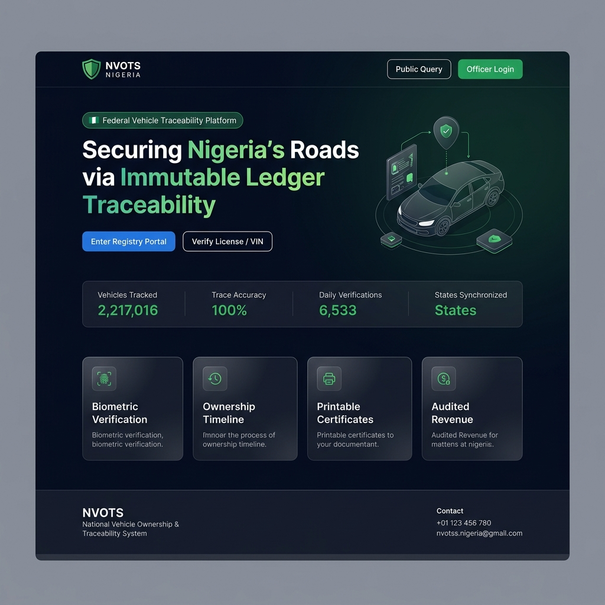
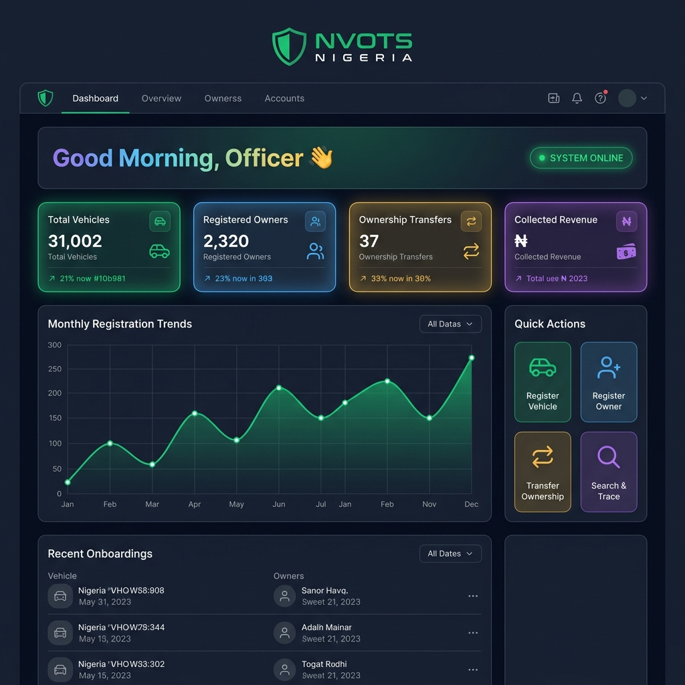

# 🛡️ NVOTS — National Vehicle Ownership & Traceability System

<p align="center">
  
</p>

<p align="center">
  <a href="#features"><strong>Features</strong></a> ·
  <a href="#screenshots"><strong>Screenshots</strong></a> ·
  <a href="#tech-stack"><strong>Tech Stack</strong></a> ·
  <a href="#installation"><strong>Installation</strong></a> ·
  <a href="#configuration"><strong>Configuration</strong></a> ·
  <a href="#user-roles"><strong>User Roles</strong></a> ·
  <a href="#license"><strong>License</strong></a>
</p>

<p align="center">
  
  
  
  
  
</p>

---

## 📌 Overview

**NVOTS** (National Vehicle Ownership & Traceability System) is a cryptographically secured, government-grade web platform built for Nigeria's Federal Ministry of Transportation. It provides an immutable digital ledger that maps biometric ownership, real-time plate authentication, and complete vehicle lifecycle management across all Nigerian federation states.

> A full suite of digital tracking assets ensuring Nigerian vehicle histories are secure, authenticated, and tamper-proof.

---

## ✨ Features

### 🚗 Vehicle Management
- Full vehicle registration with VIN, plate number, make, model, color, year
- Multi-photo upload per vehicle
- Document attachments (insurance, roadworthiness, etc.)
- Vehicle status tracking (Active / Suspended / Deregistered)
- Dynamic custom fields per vehicle type

### 👤 Owner Management
- NIN-verified (National Identification Number) owner registration
- Biometric face capture via webcam
- Digital signature pad capture
- Owner history & activity audit trail

### 🔗 Ownership Transfer
- Secure peer-to-peer vehicle ownership transfer
- Full seller → buyer chain with sale price and date
- Immutable transfer ledger with printable certificate

### ✅ Verification System
- Officer-initiated vehicle verification requests
- Approval workflow (Pending → Approved / Rejected)
- QR-code linked printable verification certificates

### 🔍 Public Registry Lookup
- Public vehicle trace by Plate Number or VIN
- No login required for public citizens
- Audit-safe read-only response

### 💳 Payment & Revenue Tracking
- Paystack payment gateway integration
- Cash & bank transfer fee tracking
- Receipt number generation & PDF receipt storage
- Commission management for beneficiaries/agents

### 📊 Admin Dashboard
- Real-time stats: vehicles, owners, transfers, revenue
- Monthly registration trends chart (Chart.js)
- Activity feed and recent onboarding list
- Role-based data visibility

### 🛡️ Security
- Role-based access control (RBAC) with 4 defined roles
- Session hardening (HTTPOnly, SameSite, HTTPS-only cookies)
- Audit log for all admin actions
- SSL-ready configuration

---

## 📸 Screenshots

### Landing Page
<p align="center">
  
</p>

### Admin Dashboard
<p align="center">
  
</p>

---

## 🧱 Tech Stack

| Layer | Technology |
|-------|-----------|
| **Backend** | PHP 8.x (Custom MVC Framework) |
| **Database** | MySQL |
| **Frontend** | Bootstrap 5, Chart.js, Font Awesome 6 |
| **PDF Generation** | Dompdf |
| **Spreadsheet Export** | PhpSpreadsheet |
| **Payment Gateway** | Paystack API |
| **Session Security** | PHP Native (HTTPOnly, SameSite) |

---

## 🗂️ Project Structure

```
NG-Vehicles/
├── App/
│   ├── Controllers/          # All route controllers (MVC)
│   │   ├── VehicleController.php
│   │   ├── OwnerController.php
│   │   ├── AdminController.php
│   │   ├── PaystackController.php
│   │   └── ...
│   ├── Models/               # Database models
│   │   ├── Vehicle.php
│   │   ├── Owner.php
│   │   ├── Transfer.php
│   │   └── ...
│   ├── views/                # PHP view templates
│   │   ├── admin/
│   │   ├── vehicles/
│   │   ├── owners/
│   │   └── ...
│   └── helpers.php
├── config/
│   ├── app.php               # App name, roles, base URL
│   ├── database.php          # DB credentials
│   ├── paystack.php          # Paystack API keys
│   └── paystack_banks.php
├── core/                     # Framework core (Auth, Router, DB)
├── public/
│   ├── css/
│   ├── js/
│   ├── images/
│   └── uploads/
├── migrations/               # SQL migration scripts
├── docs/
│   └── screenshots/
├── database.sql              # Full database dump
├── index.php                 # Front controller
├── install.php               # Installer
└── composer.json
```

---

## ⚙️ Installation

### Prerequisites
- PHP >= 8.0
- MySQL >= 5.7
- Apache / Nginx web server (XAMPP recommended for local)
- Composer

### Steps

1. **Clone the repository**
   ```bash
   git clone https://github.com/WQS-company/NG-Vehicles.git
   cd NG-Vehicles
   ```

2. **Install PHP dependencies**
   ```bash
   composer install
   ```

3. **Create database**
   ```sql
   CREATE DATABASE nvots_db CHARACTER SET utf8mb4 COLLATE utf8mb4_unicode_ci;
   ```

4. **Import the database schema**
   ```bash
   mysql -u root -p nvots_db < database.sql
   ```

5. **Configure the application**

   Copy and edit your config files:
   ```bash
   # Edit config/database.php with your DB credentials
   # Edit config/paystack.php with your Paystack API keys
   ```

6. **Set up web server**

   For XAMPP, place the project in `htdocs/` and access via:
   ```
   http://localhost/NG-Vehicles
   ```

   For Apache virtual host, point DocumentRoot to the project root and ensure `mod_rewrite` is enabled.

7. **Set permissions**
   ```bash
   chmod -R 755 public/uploads/
   ```

8. **Visit the installer** *(optional)*
   ```
   http://localhost/NG-Vehicles/install.php
   ```

---

## 🔧 Configuration

### `config/database.php`
```php
define('DB_HOST', 'localhost');
define('DB_NAME', 'nvots_db');
define('DB_USER', 'root');
define('DB_PASS', '');
```

### `config/paystack.php`
```php
define('PAYSTACK_SECRET_KEY', 'sk_live_XXXXXXXXXXXXXXXX');
define('PAYSTACK_PUBLIC_KEY', 'pk_live_XXXXXXXXXXXXXXXX');
```

> ⚠️ **Never commit real API keys or database passwords to version control!**  
> Add `config/database.php` and `config/paystack.php` to `.gitignore` for production.

---

## 👥 User Roles

| Role | Description |
|------|-------------|
| `SUPER_ADMIN` | Full access — all modules, settings, user management |
| `REGISTRATION_ADMIN` | Can register vehicles, owners, and process transfers |
| `VERIFICATION_ADMIN` | Can manage and approve vehicle verification requests |
| `BENEFICIARY` | Commission-based agent with limited access |

---

## 🔗 Key Routes

| Route | Description |
|-------|-------------|
| `/` | Public landing page |
| `/search` | Public vehicle lookup by plate/VIN |
| `/auth/login` | Officer login |
| `/dashboard` | Main dashboard (authenticated) |
| `/vehicle/register` | Register new vehicle |
| `/owner/register` | Register new owner |
| `/transfer/create` | Create ownership transfer |
| `/verification/manage` | Manage verifications |
| `/payment/manage` | View payments |
| `/admin` | System administration panel |

---

## 🤝 Contributing

Contributions are welcome! Please:

1. Fork the repository
2. Create your feature branch: `git checkout -b feature/my-feature`
3. Commit your changes: `git commit -m 'Add my feature'`
4. Push to the branch: `git push origin feature/my-feature`
5. Open a Pull Request

---

## 📄 License

This project is licensed under the **MIT License**.  
© 2025 WQS Company. All rights reserved.

---

<p align="center">
  Built with ❤️ for Nigeria's Federal Vehicle Registry Infrastructure
</p>
